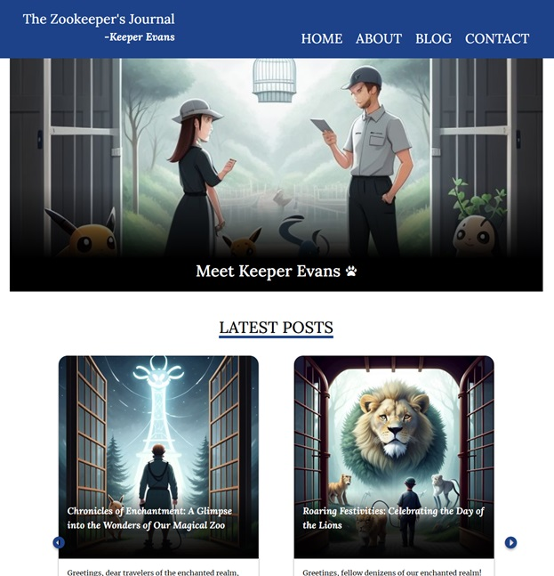

# The Zookeeper's Journal - Project Exam 1



## Description

This project is my Project Exam 1, the exam of my first year studies. 
The brief was to design and produce a blog for any theme we want and there was some specific requirements that had to be met. 

## Built With

- [HTML](https://developer.mozilla.org/en-US/docs/Web/HTML)
- [CSS](https://developer.mozilla.org/en-US/docs/Web/CSS)
- [Javascript](https://developer.mozilla.org/en-US/docs/Web/JavaScript)

## Getting Started

### Installing

1. Clone the repo:

```bash
git clone git@github.com:NoroffFEU/portfolio-1-example.git
```

2. Install the dependencies:

```
npm install
```

### Running

To run the app, run the following commands:

```bash
npm run start
```

## Contact

This is where you can leave your social links for people to contact you, such as a LinkedIn profile or Twitter link e.g.

[My LinkedIn page](https://www.linkedin.com/in/jon-henrik-aavitsland-abaa872b7/)
